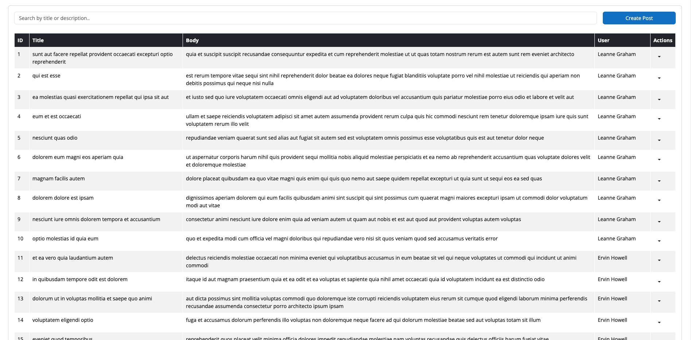

# Simple Post Management Tool with Blazor

A post management application with Blazor WebAssembly. This application allows users to read, create, delete, and update posts using the JSON placeholder API.

## Table of contents

-   [Overview](#overview)
    -   [Project Explanation](#project-explanation)
    -   [Screenshot](#screenshot)
-   [Getting Started](#getting-started)
    -   [Setup](#setup)
    -   [Development Server](#development-server)
    -   [Production](#production)
-   [Components](#components)
    -   [Data Table](#data-table)
    -   [Dropdown Form](#dropdown-form)
    -   [Post Create](#post-create)
-   [Models](#models)
    -   [Header](#header)
    -   [Post](#post)
    -   [User](#user)
-   [Services](#services)
    -   [Post Service](#post-service)
    -   [User Service](#user-service)
-   [Notes](#Nnotes)

## Overview

### Project Explanation

This application has been developed to focus on fundamental frontend operations in Blazor, including interaction with APIs and getting accustomed to Blazor's modular architecture.

#### Purpose

The primary goal of this project is to learn and practice core frontend tasks using Blazor. It provides a practical way to understand how to manage user interfaces, handle user interactions, and communicate with external APIs within a Blazor application.

#### Key Components

1. **Blazor Components**:

    - **DataTable**: Displays a table with headers and posts.
    - **DropdownForm**: A modal form for editing or creating posts, with options to save or delete.
    - **PostCreate**: A modal dialog used for creating or editing posts with customizable content and actions.

2. **Services**:
    - **PostService**: Manages HTTP requests for posts, including fetching, creating, updating, and deleting posts from an API.
    - **UserService**: Handles fetching user data from an API.
    - **NotificationService**: Provides event-based notifications for post save and delete actions, enabling other parts of the application to respond to these events.

#### Features

-   **API Communication**: The application demonstrates how to interact with APIs using HTTP requests. This includes retrieving lists of posts and users, and managing individual posts through create, update, and delete operations.
-   **Event Handling**: The use of events in the `NotificationService` allows for decoupled components that can react to changes in post data, making the application more flexible and responsive.
-   **Modular Architecture**: The project showcases Blazor's modular approach, making it easier to manage and scale frontend code by breaking it down into reusable components and services.

This application serves as a hands-on learning tool for mastering Blazor’s frontend capabilities and integrating it with backend services.

### Screenshot

<p align="center">
  
</p>

## Getting Started

To get started with the project, follow the instructions below:

### Installation

Clone the repository:

```bash
git clone https://github.com/barantoro/blazor-post-management
cd blazor-post-management
```

### Development Server

```bash
# dotnet
dotnet run
```

Check out the [deployment documentation](https://learn.microsoft.com/en-us/aspnet/core/blazor/host-and-deploy/webassembly?view=aspnetcore-8.0) for more information.

## Components

### Data Table

The `DataTable` displays a table with headers and posts. It dynamically creates table rows and cells based on the provided data. Additionally, it retrieves the username for each post based on the user ID.

### Props

| Prop      | Type        | Default | Description                                                                 |
| --------- | ----------- | ------- | --------------------------------------------------------------------------- |
| `Posts`   | `Post[]?`   | `null`  | An array of posts that will be displayed in the table.                      |
| `Headers` | `Header[]?` | `null`  | An array of headers to be used as table column names.                       |
| `Users`   | `User[]?`   | `null`  | An array of users to map each post's user ID to the corresponding username. |

### Methods

-   **GetUserName(int userId)** - Retrieves the username based on the user ID. Returns "Unknown User" if the ID is not found.

### Code Explanation

-   **OnParametersSet:** When the component parameters are set, this method initializes a dictionary (userDictionary) to map user IDs to usernames. This allows the GetUserName method to efficiently retrieve usernames.

```razor
protected override void OnParametersSet()
{
    if (Users != null)
    {
        userDictionary = Users.ToDictionary(user => user.Id, user => user.Name ?? "No Name");
    }
}
```

-   **GetUserName:** This method tries to get the username from the dictionary using the user ID. If the user ID is not found, it returns "Unknown User".

```razor
private string GetUserName(int userId)
{
    if (userDictionary != null && userDictionary.TryGetValue(userId, out var userName))
    {
        return userName;
    }
    return "Unknown User";
}
```

### Example Usage

```razor
<DataTable
    Posts="posts"
    Headers="headers"
    Users="users"
/>

@code {
    private Post[] posts = new[]
    {
        new Post { ID = 1, Title = "Post 1", Body = "This is the body of post 1", UserID = 1 },
        new Post { ID = 2, Title = "Post 2", Body = "This is the body of post 2", UserID = 2 }
    };

    private Header[] headers = new[]
    {
        new Header { Items = new[] { "ID", "Title", "Body", "Author", "Actions" } }
    };

    private User[] users = new[]
    {
        new User { Id = 1, Name = "John Doe" },
        new User { Id = 2, Name = "Jane Smith" }
    };
}
```

### DropdownForm

The `DropdownForm` component displays a dropdown menu containing a form to edit and manage post data. The form includes fields for the post's title and body, and buttons to save, delete, or reset the form.

### Props

| Prop       | Type                  | Default | Description                                                       |
| ---------- | --------------------- | ------- | ----------------------------------------------------------------- |
| `OnSave`   | `EventCallback<Post>` | `-`     | Callback event triggered when the form is successfully submitted. |
| `OnDelete` | `EventCallback<Post>` | `-`     | Callback event triggered when the delete button is clicked.       |
| `Post`     | `Post`                | `new()` | The post object that will be edited or deleted.                   |

### Methods

-   **HandleOnValidSubmit** - Handles form submission when the form is valid. It triggers the OnSave callback.
-   **HandleOnDelete** - Handles the delete button click event. It triggers the OnDelete callback.
-   **ResetForm** - Resets the form fields to their default values.

### Code Explanation

-   **OnInitialized:** Initializes the EditContext with the provided Post parameter to manage form validation and state.

```razor
protected override void OnInitialized()
{
    editContext = new EditContext(Post);
    base.OnInitialized();
}
```

-   **OnParametersSet:** Reinitializes the EditContext each time the component's parameters are updated, ensuring that form state is correctly managed.

```razor
protected override void OnParametersSet()
{
    editContext = new EditContext(Post);
    base.OnParametersSet();
}
```

-   **HandleOnValidSubmit:** This method is called when the form is submitted and valid. It uses the `NotificationService` to notify about the save action.

```razor
private async Task HandleOnValidSubmit()
{
    await Task.Run(() => NotificationService.NotifySave(Post));
}
```

-   **HandleOnDelete:** This method is called when the delete button is clicked. It triggers the `NotificationService` to notify about the deletion of the post.

```razor
private async Task HandleOnDelete()
{
    NotificationService.NotifyDelete(Post);
}
```

-   **ResetForm:** Resets the form to its initial state by creating a new `Post` object and reinitializing the `EditContext`.

```razor
private void ResetForm()
{
    Post = new Post();
    editContext = new EditContext(Post);
}
```

### Example Usage

```razor
<DropdownForm
    Post="post"
    OnSave="HandleSave"
    OnDelete="HandleDelete"
/>

@code {
    private Post post = new Post { Title = "Sample Post", Body = "This is a sample post body" };

    private async Task HandleSave(Post savedPost)
    {
        // Logic to handle the save action
    }

    private async Task HandleDelete(Post postToDelete)
    {
        // Logic to handle the delete action
    }
}
```

### PostCreate

The `PostCreate` component is a modal dialog that displays content provided via parameters. It includes a header, body, and footer, with customizable content and actions. This component is typically used for creating or editing posts.

### Props

| Prop                   | Type              | Default           | Description                                                                     |
| ---------------------- | ----------------- | ----------------- | ------------------------------------------------------------------------------- |
| `Title`                | `string`          | `"Default Title"` | The title displayed in the modal header.                                        |
| `IsVerticallyCentered` | `bool`            | `true`            | Determines whether the modal is centered vertically on the screen.              |
| `BodyContent`          | `RenderFragment?` | `null`            | Custom content for the modal body.                                              |
| `FooterContent`        | `RenderFragment?` | `null`            | Custom content for the modal footer. If not provided, default buttons are used. |
| `OnSave`               | `EventCallback`   | `-`               | Callback event triggered when the save button is clicked.                       |

### Methods

-   **ShowModal** - Displays the modal dialog.
-   **HideModal** - Hides the modal dialog.

### Code Explanation

-   **ShowModal:** This method is used to display the modal by calling `ShowAsync` on the `modalInstance`.

```razor
public async Task ShowModal()
{
    await modalInstance.ShowAsync();
}
```

-   **HideModal:** This method hides the modal by calling `HideAsync` on the `modalInstance`.

```razor
public async Task HideModal()
{
    await modalInstance.HideAsync();
}
```

-   **OnSave:** This method triggers the `OnSave` callback when the save button is clicked. If custom footer content is not provided, a default "Save changes" button is displayed, which triggers this method.

```razor
<Button Color="ButtonColor.Primary" @onclick="OnSave">Save changes</Button>
```

### Example Usage

```razor
<PostCreate
    Title="Create New Post"
    BodyContent="bodyContent"
    FooterContent="footerContent"
    OnSave="HandleSave"
/>

@code {
    private RenderFragment bodyContent = builder =>
    {
        builder.AddContent(0, "This is the body content for creating a new post.");
    };

    private RenderFragment footerContent = builder =>
    {
        builder.OpenComponent<Button>(0);
        builder.AddAttribute(1, "Color", ButtonColor.Secondary);
        builder.AddAttribute(2, "ChildContent", (RenderFragment)(builder2 => builder2.AddContent(0, "Cancel")));
        builder.AddAttribute(3, "onclick", EventCallback.Factory.Create(this, HideModal));
        builder.CloseComponent();

        builder.OpenComponent<Button>(4);
        builder.AddAttribute(5, "Color", ButtonColor.Primary);
        builder.AddAttribute(6, "ChildContent", (RenderFragment)(builder2 => builder2.AddContent(0, "Save Post")));
        builder.AddAttribute(7, "onclick", EventCallback.Factory.Create(this, HandleSave));
        builder.CloseComponent();
    };

    private async Task HandleSave()
    {
        // Logic to handle the save action
    }

    private async Task HideModal()
    {
        // Logic to handle modal close
    }
}
```

## Models

### Header

```razor
public class Header
{
    public string[]? Items { get; set; }
}
```

### Post

```razor
public class Post
{
    public int UserID { get; set; }
    public int ID { get; set; }
    public string? Title { get; set; }
    public string? Body { get; set; }
}
```

### User

```razor
public class User
{
    public int Id { get; set; }
    public string? Name { get; set; }
    public string? Username { get; set; }
    public string? Email { get; set; }
    public Address? Address { get; set; }
    public string? Phone { get; set; }
    public string? Website { get; set; }
    public Company? Company { get; set; }
}

public class Address
{
    public string? Street { get; set; }
    public string? Suite { get; set; }
    public string? City { get; set; }
    public string? Zipcode { get; set; }
    public Geo? Geo { get; set; }
}

public class Geo
{
    public string? Lat { get; set; }
    public string? Lng { get; set; }
}

public class Company
{
    public string? Name { get; set; }
    public string? CatchPhrase { get; set; }
    public string? Bs { get; set; }
}
```

## Services

### Post Service

The `Post` class provides methods for interacting with a remote API to manage posts. It includes methods for fetching, creating, updating, and deleting posts using HTTP requests.

### Constructor

| Parameter    | Type         | Description                                                |
| ------------ | ------------ | ---------------------------------------------------------- |
| `httpClient` | `HttpClient` | An instance of `HttpClient` used for making HTTP requests. |

### Methods

#### `FetchPostsAsync`

Fetches a list of posts from the API.

```csharp
public async Task<List<Post>> FetchPostsAsync()
```

-   **Returns:** `Task<List<Post>>` A task that represents the asynchronous operation, containing a list of `Post` objects.
-   **Exceptions:** Throws an `Exception` with a message if the HTTP request fails.

#### `DeletePostAsync`

Deletes a post by its ID.

```csharp
public async Task<bool> DeletePostAsync(int postId)
```

-   **Parameters:** `postId (int)` The ID of the post to be deleted.
-   **Returns:** `Task<bool>` task that represents the asynchronous operation, returning `true` if the deletion was successful, otherwise `false`.
-   **Exceptions:** Throws an `Exception` with a message if the HTTP request fails.

#### `UpdatePostAsync`

Updates an existing post with new data.

```csharp
public async Task<bool> UpdatePostAsync(int id, Post post)
```

-   **Parameters:**
    -- `id (int)` The ID of the post to be updated.
    -- `post (Post)` The updated post object.
-   **Returns:** `Task<bool>` task that represents the asynchronous operation, returning `true` if the deletion was successful, otherwise `false`.
-   **Exceptions:** Throws an `Exception` with a message if the HTTP request fails.

#### `CreatePostAsync`

Creates a new post.

```csharp
public async Task<(bool IsSuccess, Post CreatedPost)> CreatePostAsync(Post post)
```

-   **Parameters:** `post (Post)` The post object to be created.
-   **Returns:** `Task<(bool IsSuccess, Post CreatedPost)>` A task that represents the asynchronous operation, returning a tuple where `IsSuccess` indicates whether the creation was successful, and `CreatedPost` contains the newly created post.
-   **Exceptions:** Throws an `Exception` with a message if the HTTP request fails.

### Code Explanation

-   **FetchPostsAsync:** This method sends a `GET` request to the API to retrieve a list of posts. It handles any `HttpRequestException` and rethrows it with a custom message.

```razor
public async Task<List<Post>> FetchPostsAsync()
{
    try
    {
        return await _httpClient.GetFromJsonAsync<List<Post>>($"{ApiUrl}/posts");
    }
    catch (HttpRequestException ex)
    {
        throw new Exception("Error fetching posts", ex);
    }
}
```

-   **DeletePostAsync:** This method sends a `DELETE` request to the API to remove a post by its ID. It checks the response for success and handles exceptions.

```razor
public async Task<bool> DeletePostAsync(int postId)
{
    try
    {
        var response = await _httpClient.DeleteAsync($"{ApiUrl}/posts/{postId}");
        response.EnsureSuccessStatusCode();
        return response.IsSuccessStatusCode;
    }
    catch (HttpRequestException ex)
    {
        throw new Exception("Error deleting post", ex);
    }
}
```

-   **UpdatePostAsync:** This method sends a `PUT` request to update an existing post. It ensures the request was successful and handles any exceptions.

```razor
public async Task<bool> UpdatePostAsync(int id, Post post)
{
    try
    {
        var response = await _httpClient.PutAsJsonAsync($"{ApiUrl}/posts/{id}", post);
        response.EnsureSuccessStatusCode();
        return response.IsSuccessStatusCode;
    }
    catch (HttpRequestException ex)
    {
        throw new Exception("Error updating post", ex);
    }
}
```

-   **CreatePostAsync:** This method sends a `POST` request to create a new post. It returns a tuple indicating success and the created post, and handles exceptions.

```razor
public async Task<(bool IsSuccess, Post CreatedPost)> CreatePostAsync(Post post)
{
    try
    {
        var response = await _httpClient.PostAsJsonAsync($"{ApiUrl}/posts", post);
        response.EnsureSuccessStatusCode();
        var createdPost = await response.Content.ReadFromJsonAsync<Post>();
        return (response.IsSuccessStatusCode, createdPost);
    }
    catch (HttpRequestException ex)
    {
        throw new Exception("Error creating post", ex);
    }
}
```

### User Service

The `User` class provides a method for interacting with a remote API to fetch user data. It is designed to retrieve a list of users using an HTTP request.

### Constructor

| Parameter    | Type         | Description                                                |
| ------------ | ------------ | ---------------------------------------------------------- |
| `httpClient` | `HttpClient` | An instance of `HttpClient` used for making HTTP requests. |

### Methods

#### `FetchUsersAsync`

Fetches a list of users from the API.

```csharp
public async Task<List<User>> FetchUsersAsync()
```

-   **Returns:** `Task<List<User>>` A task that represents the asynchronous operation, containing a list of `User` objects.
-   **Exceptions:** Throws an `Exception` with a message if the HTTP request fails.

### Code Explanation

-   **FetchUsersAsync:** This method sends a `GET` request to the API to retrieve a list of users. It handles any `HttpRequestException` that occurs during the request by throwing an `Exception` with a custom error message.

```razor
public async Task<List<User>> FetchUsersAsync()
{
    try
    {
        return await _httpClient.GetFromJsonAsync<List<User>>($"{ApiUrl}/users");
    }
    catch (HttpRequestException ex)
    {
        throw new Exception("Error fetching users", ex);
    }
}
```

## Notes
